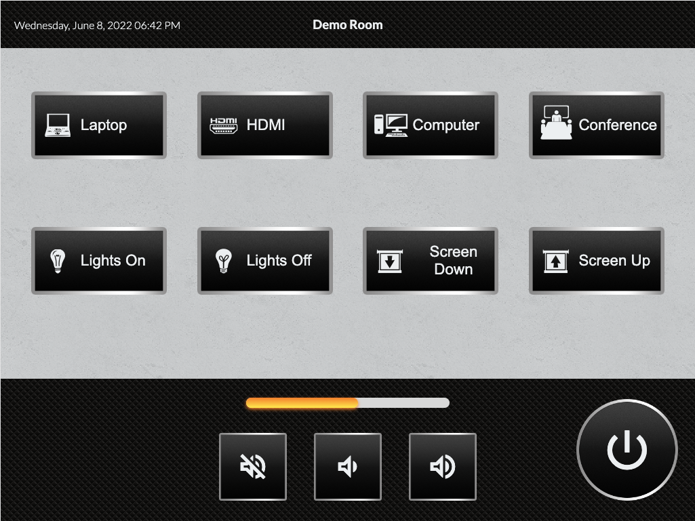

# HTML5 Control Interface

A sample HTML5 project for controlling audiovisual and building systems.

## Resources

See the [Messaging and DomHandler repo](https://github.com/catchtechnologies/HTML-Control-Interface-Messaging-And-DomHandler) for complete documentation on integrating this interface with control and automation systems.

## Screenshot

